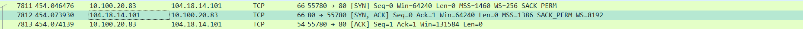

# Jarkom-Modul-1-E21-2023

Laporan Resmi Praktikum Jaringan Komputer Modul 1

## Nama Anggota:

- [Yoel Mountanus Sitorus](https://github.com/zemetia) - 5025211078
- [Java Kanaya Prada](https://github.com/javakanaya) - 5025211112

## Soal

### Soal 1

User melakukan berbagai aktivitas dengan menggunakan protokol FTP. Salah satunya adalah mengunggah suatu file.

**Penyelesaian:**

Pertama melakukan filter untuk mendapatkan paket data yang menggunakan protokol FTP dengan kueri filter `ftp`, berikutinya mencari paket data yang menggunakan perintah STOR, yaitu perintah yang digunakan untuk mengunggah suatu file, didapatkan yaitu nomor paket 147. Lalu untuk mendapatkan sequence number (raw) dan acknowledge number (raw), dengan meng-klik paket tersebut, dan pada bagian kiri bawah, membuka _dropdown_ Transmission Control Protocol, pada bagian kiri bawah.


Berikutnya, yaitu mendapatkan respon dari aktivitas tersebut. Kita melihat melalui wireshark (paket 147, kolom info) bahwa file yang diunggah adalah file _.zip_, Maka pada kita perlu mencari paket data yang juga mengandung file _.zip_ tersebut. Karena merupakan respon, maka paket tersebut berada setelah dari paket 147, dan ternyata paket tersebut bersebelahan dengan paket 147. Lalu untuk mendapatkan sequence number (raw) dan acknowledge number (raw), sama seperti pada langkah sebelumnya.


- Berapakah sequence number (raw) pada packet yang menunjukkan aktivitas tersebut?

  **Jawab:** 258040667

- Berapakah acknowledge number (raw) pada packet yang menunjukkan aktivitas tersebut?

  **Jawab:** 1044861039

- Berapakah sequence number (raw) pada packet yang menunjukkan response dari aktivitas tersebut?

  **Jawab:** 1044861039

- Berapakah acknowledge number (raw) pada packet yang menunjukkan response dari aktivitas tersebut?

  **Jawab:** 258040696


### Soal 2

Sebutkan web server yang digunakan pada portal praktikum Jaringan Komputer!

**Penyelesaian:**

Pertama melakukan filter untuk mendapatkan paket yang memiliki alamat IP portal praktikum, `10.21.78.111`, menggunakan kueri filter `ip.addr == 10.21.78.111`.


Kemudian pilih, salah satu paket, disini kami memilih paket dengan protokol HTTP, klik-kanan lalu pilih follow, lalu klik HTTP Stream. Lalu akan muncul tampilan jendela baru, dan detail web server yang digunakan pada portal praktikum akan muncul pada bagian berikut:


**Jawab:** **_Gunicorn_**

### Soal 3

Dapin sedang belajar analisis jaringan. Bantulah Dapin untuk mengerjakan soal berikut:

- Berapa banyak paket yang tercapture dengan IP source maupun destination address adalah 239.255.255.250 dengan port 3702?

  **Penyelesaian:**

  Pertama kita mencari paket dengan IP Source/destination 239.255.255.250, menggunakan kueri filter `ip.src == 239.255.255.250 || ip.dst == 239.255.255.250`. Dari hasil yang didapat kita mencari paket dengan port 3702, dan terlihat bahwa protokolnya adalah protokol **_UDP_**.

  

  Kemudian, karena telah mengetahui protokol yang digunakan, kita memperbarui kueri filter kita menjadi seperti berikut `(ip.src == 239.255.255.250 && udp.srcport == 3702) || (ip.dst = 239.255.255.250 && up.dstport == 3702)`

  

  Hasil filter tersebut merupakan paket yang tercapture dengan IP source maupun destination address adalah 239.255.255.250 dengan port 3702, dan jumlah paket tersebut adalah 21

  **Jawab:** 21

- Protokol layer transport apa yang digunakan?

  **Penyelesaian:**

  Didapatkan dari langkah sebelumnya, protokolnya yaitu **_UDP_**

  **Jawab:** UDP


### Soal 4

Berapa nilai checksum yang didapat dari header pada paket nomor 130?

**Penyelesaian:**

Sesuai Perintah soal, yaitu menuju ke paket nomor 130. Lalu diklik, dan pada dropdown _User Datagram Protocol_ akan terdapat nilai Checksum


**Jawab:** 0x18e5

### Soal 5

Elshe menemukan suatu file packet capture yang menarik. Bantulah Elshe untuk menganalisis file packet capture tersebut.

**Penyelesaian:**

Sebelumnya saya sudah mencoba mencari-cari mana yang aneh tapi ga dapet dapet eh tau nya malah salah pcap (Saddd mbakk sadddd). \
Saat Pcap yang baru sudah di update Aneh nya itu langsung ada didepan mata. Saya coba Follow salah satu dari beberapa SMTP yang aneh tersebut. Lalu ketika di scroll kita dapat langsung menemukan sebuah pesan yang berisikan password untuk zip dalam bentuk base64 encrypted message. Setelah itu kita decode passwordnya dengan online base64 decoder lalu memasukkan password tersebut dalam zip filenya


Setelah password dimasukkan ternyata didalam text file terdapat IP netcut untuk soalnya dan untuk mendapatkan Flagnya.


- Berapa banyak packet yang berhasil di capture dari file pcap tersebut?

  

  **Jawab: 60**

- Port berapakah pada server yang digunakan untuk service SMTP?

  

  **Jawab: 25**

- Dari semua alamat IP yang tercapture, IP berapakah yang merupakan public IP?

  

  **Jawab: 74.53.140.153**


### Soal 6

Seorang anak bernama Udin Berteman dengan SlameT yang merupakan seorang penggemar film detektif. sebagai teman yang baik, Ia selalu mengajak slamet untuk bermain valoranT bersama. suatu malam, terjadi sebuah hal yang tak terdUga. ketika udin mereka membuka game tersebut, laptop udin menunjukkan sebuah field text dan Sebuah kode Invalid bertuliskan "server SOURCE ADDRESS 7812 is invalid". ketika ditelusuri di google, hasil pencarian hanya menampilkan a1 e5 u21. jiwa detektif slamet pun bergejolak. bantulah udin dan slamet untuk menemukan solusi kode error tersebut.

**Penyelesaian:**

Terdapat huruf kapital yang cukup `sus` pada soal. Dan jika huruf-huruf kapital tersebut disatukan akan membentuk sebuah kata perintah `S U B T I T U S I SERVER ADDRESS`. Setelah kata `SERVER ADDRESS` ada angka 7812 yang kemungkinan besar menunjukkan nomor sebuah paket dari pcap yang tersedia. \
Dari perintah tersebut kita diminta untuk menSubtitusikan Server Address (Alamat IP) dari paket no. 7812 tersebut dengan chiper pada clue selanjutnya yaitu `a1 e5 u21` atau simplenya nama chiper ini adalah chiper `a1z26`



Dari gambar diatas kita dapat bahwa IP address dari paket nomor 7812 adalah `104.18.14.101`. Sesuai dengan ketentuan dari chiper a1z26 maka tidak mungkin angka tersebut lebih dari 26. semua angka dari IP paket tersebut akan digabungkan tetapi harus tetap lebih kecil sama dengan 26.

```
10 (J)
4  (D)
18 (R)
14 (N)
10 (J)
1  (A)
```

Maka kita mendapat jawabannya yaitu JDRNJA

**Jawab: JDRNJA**

### Soal 7

Berapa jumlah packet yang menuju IP 184.87.193.88?

**Penyelesaian:**

Lakukan filter untuk mendapatkan paket yang menuju ke IP tersebut, dengan menggunakan kueri filter berikut `ip.src == 184.87.193.88`. Terlihat hanya terdapat 6 paket yang menuju ke IP tersebut.


**Jawab:** 6

### Soal 8

Berikan kueri filter sehingga wireshark hanya mengambil semua protokol paket yang menuju port 80! (Jika terdapat lebih dari 1 port, maka urutkan sesuai dengan abjad)

**Jawab:**

### Soal 9

Berikan kueri filter sehingga wireshark hanya mengambil paket yang berasal dari alamat 10.51.40.1 tetapi tidak menuju ke alamat 10.39.55.34!

**Penyelesaian:**

Kita menggunakan `ip.src == 10.51.40.1` untuk mendapatkan paket yang berasal dari alamat tersebut. dan `ip.dst != 10.39.55.34` untuk mendapatkan paket yang tidak menuju ke alamat tersebut. Keduanya digabungkan dengan operator logika `&&` yang berarti kedua kondisi harus terpenuhi, maka hasil filter akan menampilkan paket-paket yang berasal dari alamat `10.51.40.1` dan tidak menuju ke alamat `10.39.55.34`.

**Jawab:** `ip.src == 10.51.40.1 && ip.dst != 10.39.55.34`

### Soal 10

Sebutkan kredensial yang benar ketika user mencoba login menggunakan Telnet

**Penyelesaian:**

Lakukan display filter hanya untuk paket yang menggunakan protocol "Telnet" dengan sesimple mengetik "telnet" pada display filter bar.


Pada paket-paket telnet tersebut ada banyak percobaan untuk login tetapi kita hanya ingin mencari paket yang mengindikasi sukses Login. Jika paket login berhasil ditemukan kemungkinan paket paket sebelumnya yang berasal dari IP client merupakan paket yang dikirimkan dan berupa kredensial dari user yang tepat dan berhasil login.


Kita coba lihat 1 paket diatasnya dan ada data berupa text yaitu `kesayangannyak0k0``


Dan beberapa data diatasnya merupakan 1 char, tetapi char ini memiliki pola yang menarik dan tidak random yang tersebar pada paket yang ada pada screenshot dibawah.


yang kira kira berisi.

```
d
d
h
h
a
a
f
f
i
i
n
n
```

dengan beberapa paket sebelumnya yang juga ada mengirim user:pass berupa dhafin:kesayangannyak0k0
**Jawab: dhafin:kesayangannyak0k0**
